### `~/ whoami`

Information Systems Security Engineer Intern **@ SAP NS2**, working in a FedRAMP-aligned environment on security-operations automation and cloud compliance. IT & Cybersecurity student at **George Mason University**.

I design and ship **production-grade cloud, security, and Kubernetes systems** — end-to-end, entirely in code, with AI woven into the operations layer. What's below isn't a list of tutorials. It's one connected platform: the stack a real engineering team runs on.

#### ◤ ARSENAL ◢

#### ◤ TELEMETRY ◢

## ▚ 01 · CLOUD & PLATFORM ENGINEERING

▸ **[Full-Stack CI/CD Pipeline → ECS Fargate](https://github.com/Vziraka/fullstack-cicd-pipeline)** — 4-job GitHub Actions pipeline: Jest → multi-stage Docker → Trivy CVE gate → **OIDC to AWS (zero static keys)** → ECR → ECS staging → prod behind a manual approval gate. Every deploy auto-writes a stakeholder summary via Claude. All infra in Terraform.

▸ **[Serverless AI Document API](https://github.com/Vziraka/serverless-ai-api-)** — PDF → presigned S3 upload (the Lambda never touches the bytes) → Claude extracts summary + topics → DynamoDB. Cognito JWT auth, Secrets Manager rotation, SQS DLQ, 22 unit tests, zero hardcoded credentials.

▸ **[Terraform Starter Kit — Secure 3-Tier AWS](https://github.com/Vziraka/terraform-starter-kit)** — Modular Terraform: 2-AZ VPC, bastion, defense-in-depth security groups, least-privilege IAM, encrypted RDS, versioned S3. Remote state in S3 + DynamoDB locking, isolated dev/prod.

▸ **[AI Cost-Optimization Dashboard](https://github.com/Vziraka/cost-optimization-dashboard)** — Weekly EventBridge → Lambda pulls Cost Explorer spend → DynamoDB trends → Claude flags >20% week-over-week jumps and posts the top 3 savings to Slack `#finops`.

## ▚ 02 · KUBERNETES & OBSERVABILITY

▸ **[K8s Microservices Platform](https://github.com/Vziraka/k8s-microservices-)** — 2 Node.js services, nginx ingress, HPA autoscaling 2→5 pods, one-command Helm chart. An AI health CronJob reads cluster state via read-only RBAC → Claude → GREEN/YELLOW/RED to Slack every 5 min.

▸ **[Monitoring & Alerting Stack](https://github.com/Vziraka/monitoring-alerting-stack-)** — Full observability via kube-prometheus-stack: Prometheus RED metrics, Grafana, Alertmanager → Slack with runbook links. An AI anomaly CronJob classifies severity so it only pings when something's actually wrong. 10 incident runbooks.

## ▚ 03 · SECURITY OPERATIONS & RESILIENCE

▸ **[SOC Automation Pipeline — Splunk + n8n + AI](https://github.com/Vziraka/SOC-automation-project)** — End-to-end SOAR: Splunk detects → n8n orchestrates → AbuseIPDB enriches → AI writes analyst-ready triage → Slack. Manual triage driven to near-zero.

▸ **[Azure SOC Homelab](https://github.com/Vziraka/Azure-SOC-HomeLab)** — Microsoft Sentinel + Log Analytics, KQL detections for failed logons (Event ID 4625), geo-mapped attack visualization via Watchlists.

▸ **[Disaster Recovery & Security Posture](https://github.com/Vziraka/disaster-recovery-system)** — Cross-region AWS Backup (RDS + S3 → us-west-2), Security Hub (CIS + FSBP), and a Lambda that turns findings into a plain-English posture report every 6h.

## ▚ 04 · AUTONOMOUS AI SYSTEMS

▸ **AI Agent System** *(private)* — 24/7 autonomous infrastructure: specialized agents (Intel, Research, Developer, R&D Debate Council) behind a Next.js Mission Control with live heartbeats, cost tracking, and an approval queue. Hard security guardrails and a daily API spend cap.

## ▚ CURRENT ROLE

**Information Systems Security Engineer Intern · SAP NS2**
Security-operations automation, security-tool integration via APIs, and vulnerability-management & compliance monitoring in a FedRAMP-aligned environment.

## ▚ CERTIFICATIONS & TRAINING

## ▚ CONNECT

<code>SOC & Detection Engineering · Cloud Security (AWS/Azure) · Kubernetes Security · DevSecOps · Security Automation</code>

